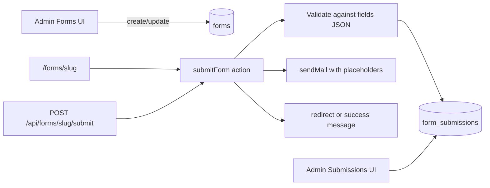

# Generalized Forms Storage & Submission System

## Goal

Store **form definitions** and **submission records** in dedicated tables so any form type (contact, newsletter, quote request, etc.) reuses one pipeline instead of one-off tables.



---

## 1. Database schema

Add to [`prisma/schema.prisma`](prisma/schema.prisma):

```prisma
enum FormStatus {
  ACTIVE
  INACTIVE
}

model Form {
  id          String           @id @default(uuid())
  title       String
  slug        String           @unique
  status      FormStatus       @default(ACTIVE)
  fields      Json             // FormFieldDefinition[]
  email       Json?            // FormEmailSettings | null
  submit      Json             // FormSubmitSettings
  submissions FormSubmission[]
  createdAt   DateTime         @default(now())
  updatedAt   DateTime         @updatedAt

  @@map("forms")
}

model FormSubmission {
  id        String   @id @default(uuid())
  formId    String
  form      Form     @relation(fields: [formId], references: [id], onDelete: Cascade)
  data      Json     // Record<fieldName, value>
  ip        String?
  source    String?  // referrer or page URL
  userAgent String?
  createdAt DateTime @default(now())

  @@index([formId])
  @@index([createdAt])
  @@map("form_submissions")
}
```

**Design notes:**
- `fields` on `Form` stores **definitions** (label, name/key, type, required, options) — not submitted values.
- `data` on `FormSubmission` stores **submitted values** keyed by field `name`.
- `email` and `submit` are JSON columns (same pattern as [`Option.value`](prisma/schema.prisma) and redirect settings) to avoid schema churn when adding notification options later.
- `slug` enables stable public URLs and API paths (`/forms/contact`, `/api/forms/contact/submit`).

Run migration: `npx prisma migrate dev --name add_forms_tables`

---

## 2. TypeScript types & validation

New file: [`src/types/forms.ts`](src/types/forms.ts)

```typescript
// Field definition (stored on Form.fields)
type FormFieldDefinition = {
  id: string;
  name: string;       // slug key, e.g. "email", "message"
  label: string;
  type: "text" | "email" | "textarea" | "select" | "checkbox" | "number" | "tel";
  required?: boolean;
  placeholder?: string;
  options?: { label: string; value: string }[];
};

type FormEmailSettings = {
  enabled: boolean;
  to: string;
  fromEmail?: string;   // optional override; fallback to SMTP settings
  fromName?: string;
  subject: string;      // supports {{fieldName}}, {{siteTitle}}, etc.
  body: string;         // plain text/HTML with {{fieldName}} placeholders
  replyToField?: string; // field name whose value becomes Reply-To
};

type FormSubmitSettings = {
  mode: "redirect" | "message";
  redirectUrl?: string;
  successMessage?: string;
};
```

New file: [`src/lib/forms/schemas.ts`](src/lib/forms/schemas.ts) — Zod schemas for:
- `formFieldDefinitionSchema`, `formEmailSettingsSchema`, `formSubmitSettingsSchema`
- `createFormSchema` / `updateFormSchema`
- `submitFormSchema` (dynamic: built at runtime from stored `fields`)

New file: [`src/lib/forms/validate-submission.ts`](src/lib/forms/validate-submission.ts) — validate incoming payload against field definitions (required checks, email format, select option whitelist).

New file: [`src/lib/forms/render-placeholders.ts`](src/lib/forms/render-placeholders.ts) — reuse placeholder pattern from [`src/lib/email/render-template.ts`](src/lib/email/render-template.ts) (`{{fieldName}}`, `{{siteTitle}}`, `{{formTitle}}`).

---

## 3. Server actions

Follow existing patterns in [`src/actions/tags/create-tag.ts`](src/actions/tags/create-tag.ts):

| Action | File | Permission |
|--------|------|------------|
| Create form | `src/actions/forms/create-form.ts` | `forms:write` (new) |
| Update form | `src/actions/forms/update-form.ts` | `forms:write` |
| Delete form | `src/actions/forms/delete-form.ts` | `forms:write` |
| Submit form (public) | `src/actions/forms/submit-form.ts` | none (public, rate-limit later) |
| Delete submission | `src/actions/forms/delete-submission.ts` | `forms:write` |

**`submitForm` flow:**
1. Load form by `slug` where `status = ACTIVE`
2. Validate `data` against `form.fields`
3. Extract request metadata: IP (`x-forwarded-for` / `x-real-ip`), `referer` as `source`, `user-agent`
4. Insert `FormSubmission`
5. If `email.enabled`, render subject/body with placeholders and call [`sendMail`](src/lib/email/send-mail.ts)
6. Return `{ success, mode, redirectUrl?, successMessage? }` — never fail submission if email fails (log warning instead)

**Slug generation:** auto from title via `slugify` (same as [`src/actions/pages/create.ts`](src/actions/pages/create.ts)); allow optional manual slug in admin form.

---

## 4. Public API route

New file: [`src/app/api/forms/[slug]/submit/route.ts`](src/app/api/forms/[slug]/submit/route.ts)

- `POST` only, no auth
- Body: `{ data: Record<string, unknown>, source?: string }`
- Delegates to `submitForm`
- Returns JSON with submit result (for AJAX/custom frontends)

---

## 5. Email integration

Extend [`src/lib/email/send-mail.ts`](src/lib/email/send-mail.ts) to accept optional `from` and `replyTo` overrides (form config may differ from global SMTP defaults).

On submit, build placeholders from:
- All submitted field values (`{{name}}`, `{{email}}`, …)
- Global settings (`siteTitle`, `contactEmail`) from [`getGlobalSettings`](src/lib/settings.ts)
- Form metadata (`formTitle`, `submittedAt`)

No new EJS template file required initially — use inline `body` string from form config with placeholder rendering. Admin form builder provides a textarea for email body with helper text showing available `{{placeholders}}`.

---

## 6. Admin UI

Follow tags/pages list + sheet/form patterns.

### Forms management
- [`src/app/admin/(dashboard)/forms/page.tsx`](src/app/admin/(dashboard)/forms/page.tsx) — list with search, status badge, submission count
- [`src/app/admin/(dashboard)/forms/page.client.tsx`](src/app/admin/(dashboard)/forms/page.client.tsx) — DataTable (reuse [`src/components/data-table.tsx`](src/components/data-table.tsx))
- [`src/app/admin/(dashboard)/forms/create/page.tsx`](src/app/admin/(dashboard)/forms/create/page.tsx)
- [`src/app/admin/(dashboard)/forms/[id]/edit/page.tsx`](src/app/admin/(dashboard)/forms/[id]/edit/page.tsx)
- [`src/components/admin/form-builder.tsx`](src/components/admin/form-builder.tsx) — dynamic field list editor (add/remove/reorder fields, set type/required/options)
- [`src/components/admin/form-settings-fields.tsx`](src/components/admin/form-settings-fields.tsx) — email + submit behavior sections

### Submissions viewer
- [`src/app/admin/(dashboard)/forms/[id]/submissions/page.tsx`](src/app/admin/(dashboard)/forms/[id]/submissions/page.tsx) — paginated list
- [`src/app/admin/(dashboard)/forms/[id]/submissions/page.client.tsx`](src/app/admin/(dashboard)/forms/[id]/submissions/page.client.tsx) — columns: date, IP, source, preview of key fields; row detail sheet showing full `data` JSON formatted as label/value pairs

### Sidebar & permissions
Update [`src/data/sidebar-data.ts`](src/data/sidebar-data.ts) — add **Forms** under CMS section.

Update [`src/lib/auth/permissions.ts`](src/lib/auth/permissions.ts):
```typescript
"forms:read": [SUPER_ADMIN, ADMIN, EDITOR, VIEWER],
"forms:write": [SUPER_ADMIN, ADMIN, EDITOR],
```
Add route rules for `/admin/forms`.

---

## 7. Public frontend page

New route: [`src/app/(frontend)/forms/[slug]/page.tsx`](src/app/(frontend)/forms/[slug]/page.tsx)

- Server-load active form by slug; `notFound()` if missing/inactive
- Client component [`form-renderer.tsx`](src/components/frontend/form-renderer.tsx):
  - Maps `FormFieldDefinition.type` to existing field components in [`src/components/form/`](src/components/form/) (`TextField`, `EmailField`, `TextareaField`, `SelectField`, `CheckboxField`)
  - Uses `react-hook-form` + dynamic Zod schema
  - Calls `submitForm` server action
  - On success: redirect if `submit.mode === "redirect"`, else show `successMessage` toast/inline alert

`generateMetadata` uses form title for page `<title>`.

---

## 8. API for admin list (optional but consistent)

[`src/app/api/forms/route.ts`](src/app/api/forms/route.ts) — GET with pagination + search (mirror [`src/app/api/posts/route.ts`](src/app/api/posts/route.ts)).

[`src/app/api/forms/[id]/submissions/route.ts`](src/app/api/forms/[id]/submissions/route.ts) — GET submissions for admin table refresh.

---

## 9. Example form seed (optional)

A default **Contact** form in a seed script or migration data:
- Fields: name, email, message
- Email to `contactEmail` from global settings
- Submit mode: message — "Thank you, we will get back to you soon."

---

## Files to create/modify (summary)

**New (~18 files):**
- Prisma models + migration
- `src/types/forms.ts`, `src/lib/forms/*` (3 files)
- `src/actions/forms/*` (5 files)
- `src/app/api/forms/**` (3 routes)
- `src/app/admin/(dashboard)/forms/**` (6 files)
- `src/components/admin/form-builder.tsx`, `form-settings-fields.tsx`
- `src/app/(frontend)/forms/[slug]/*`, `src/components/frontend/form-renderer.tsx`

**Modified (~4 files):**
- [`prisma/schema.prisma`](prisma/schema.prisma)
- [`src/lib/auth/permissions.ts`](src/lib/auth/permissions.ts)
- [`src/data/sidebar-data.ts`](src/data/sidebar-data.ts)
- [`src/lib/email/send-mail.ts`](src/lib/email/send-mail.ts) — optional `from` / `replyTo`

**Update task tracking:**
- Mark form integration items done in [`tasks/todos.md`](tasks/todos.md) after implementation

---

## Out of scope (defer)

- Spam protection (honeypot, reCAPTCHA, rate limiting) — add in follow-up
- Embedding forms inside BlockNote page content — use `/forms/[slug]` link for now
- Auto-reply email to submitter — can extend `FormEmailSettings` later
- Export submissions to CSV
