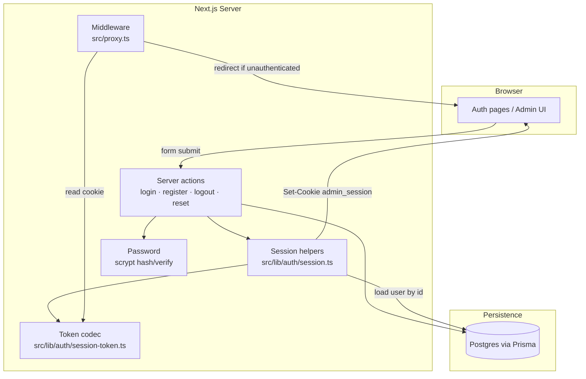

# Authentication

NextEcom uses a **custom, cookie-based session** system for the admin dashboard. There is no third-party auth provider (NextAuth, Clerk, etc.) — credentials are stored in Postgres, validated via server actions, and access is gated by a signed session cookie.

This document describes the strategy, architecture, and how to extend auth safely.

---

## Strategy

### Goals

| Goal | Approach |
|------|----------|
| Keep the stack simple | No external auth SDK; Web Crypto + cookies + Prisma |
| Server-first security | Mutations and session creation happen in server actions |
| Admin-only (today) | All protected routes live under `/admin` |
| Stateless sessions | Session payload is signed; no session table in the DB |
| Email-driven recovery | Password reset via one-time tokens + SMTP templates |

### Non-goals (current scope)

- **No storefront customer auth** — public shop pages are unauthenticated. A future “my account” area is planned separately (see [Roadmap](#roadmap)).
- **No OAuth / social login**.
- **No refresh tokens** — sessions expire after a fixed TTL; users sign in again.
- **No per-permission database tables** — roles use a fixed enum + permission map in code (see [RBAC](#rbac)).

### Why custom sessions instead of Auth.js?

- Full control over cookie shape, TTL, and validation without adapter overhead.
- Fits the project pattern: **reads from route handlers / RSC, mutations via server actions**.
- Small surface area: one `User` model, one cookie, one HMAC secret.

Trade-off: we own rotation, revocation, and future RBAC ourselves.

---

## Architecture



### Request flow (protected admin route)

1. Browser sends request with `admin_session` cookie.
2. Middleware (`src/proxy.ts`) parses and verifies the token signature + expiry.
3. If invalid and path is not public → redirect to `/admin/login?next=<path>`.
4. If valid → request proceeds; dashboard layout calls `getSession()` to load user details for the UI.

### Login flow

1. Client validates input with `loginSchema` (Zod).
2. `loginAction` looks up user by normalized email, verifies password with scrypt.
3. On success, `createSession(userId)` sets the signed cookie and redirects to `/admin` (or `next` if safe).
4. On failure, returns `{ success: false, error }` without revealing whether the email exists.

---

## Session model

### Cookie

| Property | Value |
|----------|-------|
| Name | `admin_session` (`SESSION_COOKIE_NAME`) |
| Format | `<base64url-payload>.<base64url-hmac-sha256-signature>` |
| Payload | `{ userId: string, exp: number, sessionVersion: number }` (Unix seconds) |
| Max age | 7 days |
| Flags | `httpOnly`, `sameSite: lax`, `secure` in production, `path: /` |

Signing uses `AUTH_SECRET` via Web Crypto HMAC-SHA256. Signature comparison is timing-safe.

Implementation:

- Encode / verify: `src/lib/auth/session-token.ts`
- Set / read / destroy: `src/lib/auth/session.ts`

### Server-side session lookup

`getSession()` verifies the cookie, then **loads the user from the database** by `userId`. This means:

- Deleted users lose access on the next request (payload still valid until expiry, but DB lookup returns null).
- Email/name/role changes in DB are reflected immediately in the UI via `getSession()`.
- **Session revocation:** `sessionVersion` on `User` is embedded in the cookie. When role or password changes, the version is bumped and existing cookies stop working.

---

## RBAC

Authorization is **database-backed**, not token-backed. The cookie only proves identity; permissions come from the user's `role` loaded in `getSession()`.

### Roles

| Role | Typical use |
|------|-------------|
| `SUPER_ADMIN` | Full access; first registered user gets this role |
| `ADMIN` | Manage users, settings, content, logs (read) |
| `EDITOR` | Create/edit posts, pages, media |
| `VIEWER` | Read-only access to CMS content |

### Permissions

Defined in `src/lib/auth/permissions.ts`:

| Permission | Roles |
|------------|-------|
| `posts:read` | All roles |
| `posts:write` | SUPER_ADMIN, ADMIN, EDITOR |
| `pages:read` | All roles |
| `pages:write` | SUPER_ADMIN, ADMIN, EDITOR |
| `media:read` | All roles |
| `media:write` | SUPER_ADMIN, ADMIN, EDITOR |
| `users:manage` | SUPER_ADMIN, ADMIN |
| `settings:manage` | SUPER_ADMIN, ADMIN |
| `logs:read` | SUPER_ADMIN, ADMIN |
| `logs:manage` | SUPER_ADMIN only |

### Enforcement layers

1. **Route layouts** — `RouteGuard` in section layouts (users, settings, logs, posts, pages, media) redirects to `/admin/forbidden`.
2. **Server actions** — `authorize(permission)` at the start of every mutation.
3. **API routes** — `requireApiPermission()` / `requireApiSession()` for admin APIs. Public blog listing keeps `GET /api/posts?status=PUBLISHED` open.
4. **Sidebar** — nav items filtered by role via `getNavForRole()`.

### Helpers

```ts
import { authorize, requirePermission } from "@/lib/auth/require-auth";
import { hasPermission } from "@/lib/auth/permissions";

// In server actions — returns { ok: false, error: "Forbidden" }
const auth = await authorize("posts:write");

// In layouts — redirects to login or /admin/forbidden
await requirePermission("users:manage");
```

### Assigning roles

- **Register:** first user → `SUPER_ADMIN`; others → `EDITOR`.
- **Admin create/edit user:** SUPER_ADMIN can assign ADMIN/EDITOR/VIEWER; ADMIN can assign EDITOR/VIEWER.
- Role or password change bumps `sessionVersion` (invalidates existing sessions for that user).

---

## Passwords

| Concern | Implementation |
|---------|----------------|
| Hashing | Node `scrypt` with random 16-byte salt |
| Storage format | `{salt}:{hash}` (hex) in `User.password` |
| Minimum length | 8 characters (register + reset) |
| Verification | Timing-safe compare of derived hash |

See `src/lib/password.ts`.

---

## Route protection

### Public admin paths

These do **not** require a session:

- `/admin/login`
- `/admin/register`
- `/admin/reset-password` (and `/admin/reset-password/[token]`)

Authenticated users hitting login or register are redirected to `/admin`.

### Protected paths

Everything else under `/admin/*` requires a valid session cookie.

Logic lives in `src/proxy.ts` (Next.js 16 proxy — no separate `middleware.ts` needed).

### Post-login redirect

Login accepts an optional `next` query param. Only paths that start with `/admin` and are not login/register are honored; otherwise redirect defaults to `/admin`.

---

## Server actions

All auth mutations are `"use server"` actions under `src/actions/auth/`.

| Action | File | Behavior |
|--------|------|----------|
| `loginAction` | `login.ts` | Validate → verify password → `createSession` → redirect |
| `registerAction` | `register.ts` | Validate → create user → session → welcome email → redirect |
| `logoutAction` | `logout.ts` | `destroySession` → redirect to login |
| `requestPasswordResetAction` | `request-password-reset.ts` | Always returns success message (no email enumeration) |
| `resetPasswordAction` | `reset-password.ts` | Validate token → update password → delete tokens → redirect |
| `getPasswordResetToken` | `reset-password.ts` | Server helper to validate token before showing reset form |

Admin user management (`createUser` in `src/actions/users/create-user.ts`) creates users with hashed passwords but does **not** sign them in.

### Validation schemas

Shared Zod schemas in `src/lib/auth/schemas.ts`:

- `loginSchema` — email + password
- `registerSchema` — optional name, email, password, confirmPassword
- `requestPasswordResetSchema` — email
- `resetPasswordSchema` — password + confirmPassword

Client forms use the same schemas via `react-hook-form` + `@hookform/resolvers/zod`.

---

## Database

```prisma
model User {
  id        String   @id @default(uuid())
  email     String   @unique
  name      String?
  password  String
  ...
}

model PasswordResetToken {
  id        String   @id @default(uuid())
  token     String   @unique
  userId    String
  expiresAt DateTime
  ...
}
```

Reset tokens:

- 32-byte random hex string
- TTL: **1 hour** (`RESET_TOKEN_TTL_MS`)
- Previous tokens for the same user are deleted when a new reset is requested
- All tokens for the user are deleted after a successful reset

---

## Email

| Event | Template | Trigger |
|-------|----------|---------|
| Registration | `welcome` | `registerAction` |
| Password reset | `reset-password` | `requestPasswordResetAction` |

Templates live under `src/lib/email/`. If SMTP is not configured, the reset link is logged to the console in development.

Reset URL shape: `{APP_BASE_URL}/admin/reset-password/{token}`

---

## Environment variables

| Variable | Required | Purpose |
|----------|----------|---------|
| `AUTH_SECRET` | Yes | HMAC key for session signing. Use a long random string (≥ 32 chars). |
| `DATABASE_URL` | Yes | Postgres connection for users and reset tokens |
| SMTP / `NEXT_PUBLIC_SERVER_URL` | For emails | Welcome and reset emails; base URL for links |

Generate a secret:

```bash
openssl rand -base64 32
```

---

## UI structure

```
src/app/admin/
├── (auth)/                    # Unauthenticated layout
│   ├── login/
│   ├── register/
│   └── reset-password/
│       └── [token]/
└── (dashboard)/               # Authenticated layout (sidebar, getSession)
    └── ...
```

Shared auth chrome: `src/components/admin/auth-shell.tsx`.

Logout: `logoutAction` from the user menu in `src/components/nav-user.tsx`.

---

## Security considerations

### Implemented

- Passwords hashed with scrypt, never stored in plain text
- Session cookie is `httpOnly` (not readable by JS)
- HMAC prevents tampering with `userId` / `exp`
- Timing-safe signature and password comparison
- Generic error on login failure (“Invalid email or password”)
- Password reset response does not reveal whether an email is registered
- Reset tokens are single-use and time-limited

### Gaps / follow-ups

| Item | Recommendation |
|------|----------------|
| No rate limiting | Add rate limits on login and reset endpoints (e.g. Upstash or edge counter) |
| Open registration | Consider disabling `/admin/register` in production or gating behind invite |
| Fine-grained DB permissions | Move to permission tables if enum roles are not enough |
| CSRF | Server actions use Next.js built-in origin check; keep mutations as POST actions only |

---

## Roadmap

From project tasks — not yet implemented:

1. **Storefront “my account”** — orders, profile, separate from admin auth (may share `User` or use a distinct customer model).
2. **Auth UI polish** — styling pass on login/register/reset pages.
3. **Admin-controlled auth emails** — editable templates from settings.

When adding customer auth, prefer:

- Separate cookie name or namespace (e.g. `customer_session` vs `admin_session`)
- Separate route group (e.g. `/account/*`) and middleware matcher
- Optional shared password utilities in `src/lib/password.ts`

---

## File reference

| Path | Responsibility |
|------|----------------|
| `src/lib/auth/session.ts` | Create, read, destroy session cookie |
| `src/lib/auth/session-token.ts` | Sign / parse session token |
| `src/lib/auth/schemas.ts` | Zod validation |
| `src/lib/auth/roles.ts` | Role constants (client-safe) |
| `src/lib/auth/permissions.ts` | Permission map and route rules |
| `src/lib/auth/require-auth.ts` | `authorize`, `requirePermission`, API guards |
| `src/lib/auth/filter-nav.ts` | Sidebar filtering by role |
| `src/lib/password.ts` | scrypt hash and verify |
| `src/proxy.ts` | Admin auth gate (Next.js proxy) |
| `src/components/admin/route-guard.tsx` | Layout permission wrapper |
| `src/actions/auth/*` | Auth server actions |
| `src/constants/index.ts` | `SESSION_COOKIE_NAME`, `RESET_TOKEN_TTL_MS` |
| `prisma/schema.prisma` | `User` (with `role`, `sessionVersion`), `PasswordResetToken` |

---

## Quick checklist for new auth-related work

1. Add or extend a Zod schema in `src/lib/auth/schemas.ts`.
2. Implement logic as a server action in `src/actions/auth/` (or domain-specific action with `getSession()` guard).
3. If the route is new and sensitive, add a `RouteGuard` layout and an entry in `ROUTE_RULES` inside `src/lib/auth/permissions.ts`.
4. Guard the server action with `authorize("your:permission")`.
5. For password changes, always use `hashPassword` / `verifyPassword` and bump `sessionVersion` when credentials or role change.
5. Never expose `AUTH_SECRET` or password hashes to the client.
6. Use `getSession()` in server components/actions when you need the current user — do not trust client-provided user IDs.
